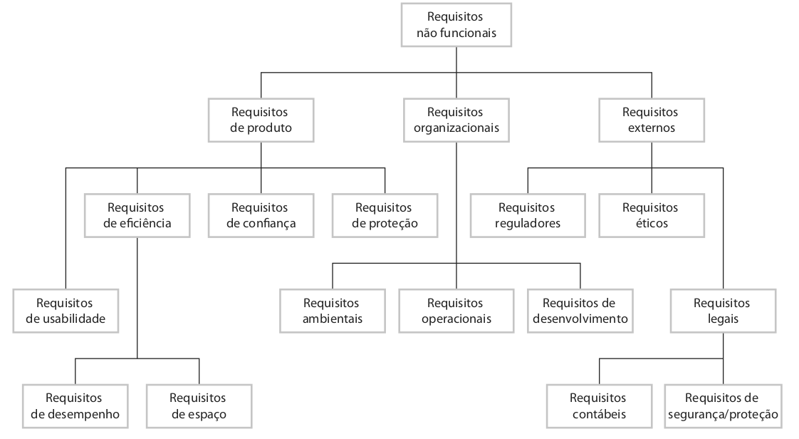

# LAB: Estudo de Caso - Especificando Requisitos de Um Sistema de Apoio à Saúde Mental

Este estudo de caso concentra-se nos requisitos de um sistema denominado _Mentcare_. É comum o uso deste tipo de sistema, por exemplo, em hospitais do Reino Unido e Escócia. O mesmo é utilizado em clínicas que atendem pessoas com transtornos mentais, registrando detalhes das consultas e condições dos pacientes.

# Passo 1: Contexto do Sistema _Mentcare_

Este sistema é separado de um sistema de registros de pacientes mais geral, visto que, informações mais específicas devem ser mantidas. Além disso, o sistema deve ser configurado para gerar documentos e relatórios de diferentes tipos, visando garantir que as leis pertinentes à saúde mental sejam respeitadas pela equipe de está atendendo os pacientes.

Este é um sistema crítico de segurança, pois uma falha pode levar a decisões que comprometam a segurança do paciente ou da equipe médica. Existem também considerações importantes de segurança e privacidade que devem ser levadas em consideração no sistema Mentcare. Por exemplo, o vazamento de dados pode expor pacientes, como ocorreu com a [rede finlandesa de terapia Vastaamo](https://www.bbc.com/portuguese/geral-54698957).

**Tarefa:** Reúna-se com o seu grupo para ler e compreender as funcionalidades e demais características do sistema, que são descritas nas próximas seções.

## Principais Funcionalidades:

* **Cuidados individuais:** Os médicos podem criar registros para pacientes, editar as informações no sistema, visualizar o histórico do paciente, etc. 

* **Monitoramento do paciente:** O sistema monitora regularmente os registros dos tratamentos dos pacientes, emitindo alertas caso sejam detectados possíveis problemas. Por exemplo, se um paciente não foi ao médico por algum tempo, um aviso pode ser emitido. Um dos elementos mais importantes do sistema de monitoramento é acompanhar os pacientes que foram submetidos a um tratamento involuntário (isto é, detidos em um hospital sem o seu consentimento). O sistema deve gerenciar os pacientes que foram detidos e garantir que todos os processos legais necessários sejam seguidos e documentados no momento certo.

* **Emissão de relatórios:** O sistema gera relatórios gerenciais mensais, mostrando o número de pacientes atendidos em cada clínica, o número de pacientes que entraram e saíram do sistema de atendimento, o número de pacientes internados, os medicamentos prescritos e seus custos, etc.

## Usuários:

Quatro tipos de usuários podem utilizar o sistema _Mentcare_:

* **Equipe clínica:** A equipe clínica interage diretamente com o sistema, consultando e modificando as informações do paciente. Eles se preocupam principalmente em manter um histórico de consultas e registrar o tratamento e a medicação prescrita aos pacientes.

* **Secretaria:** A equipe da secretaria interage diretamente com o sistema, em conjunto com um sistema geral para registrar informações sobre agendamentos de pacientes. Esta equipe precisa registrar quando as consultas foram marcadas, a data da consulta e se os pacientes compareceram ou não às consultas. Os membros da secretaria também são responsáveis por gerar relatórios para o gerenciamento da clínica médica.

* **Administrador de Sistema e Gerente de Registros:** A equipe de registros médicos é responsável por garantir a integridade e segurança geral dos dados no sistema. Eles também são responsáveis por integrar o sistema com outros sistemas de registro de pacientes, compartilhando informações quando necessário. Neste contexto, o administrador de sistema é responsável por garantir a segurança e a integridade do sistema. O gerente de registro médico é responsável por garantir que o sistema esteja em conformidade com os requisitos legais sobre informações pessoais.

* **Gerente de serviços de saúde:** O gerente dos serviços de saúde não interage diretamente com o sistema. Em vez disso, o gerente utiliza relatórios de consultas, diagnósticos e tratamentos. A criação destes relatórios é iniciada pela equipe de registros médicos. Os relatórios são gerados automaticamente pelo sistema e não contêm informações pessoais do paciente. Logo, os gerentes não têm acesso às funcionalidades clínicas do sistema ou aos prontuários individuais dos pacientes.

## Observações:

* Podemos observar que a confiabilidade do sistema é um requisito importante, assim como a segurança.

* Existem alguns conflitos entre os requisitos de privacidade do paciente e os requisitos para manter a segurança do paciente e dos cuidadores.

* Como em todos os sistemas médicos, a privacidade é um requisito crítico do sistema. É essencial que as informações do paciente sejam confidenciais e nunca sejam divulgadas a ninguém além da equipe médica autorizada e do próprio paciente. Os gerentes hospitalares não devem ter acesso às informações individuais dos pacientes.

# Passo 2: Relembrando conceitos sobre requisitos funcionais e não-funcionais

**Requisitos funcionais** estão relacionados com o que um sistema deve fazer, isto é, as suas funcionalidades. Já os **requisitos não-funcionais** estão relacionados com as restrições do sistema. Segundo Sommerville, os requisitos não-funcionais baseiam-se nas necessidades dos clientes. Eles podem ser organizados em três grandes grupos: produtos, organizacionais, e externos.

**Requisitos de produto:** Referem-se às restrições de comportamento do sistema, por exemplo, requisitos relacionados com velocidade, uso de memória e usabilidade. Exemplo:

> O sistema Mentcare deve ficar disponível para todas as clínica durante o expediente normal (segunda-sexta, 8:30h-17:30h)

> O tempo que o sistema pode permanecer fora do ar no expediente normal não deve ultrapassar 5 segundos em qualquer dia.

**Requisitos organizacionais:** Referem-se às políticas e restrições da organização, empresa, ou clientes, como requisitos relacionados com processos, ambiente operacional, etc. Por exemplo:

> Os usuários do sistema Mantcare devem se identificar usando o cartão de identificação de autoridade de saúde.

**Requisitos externos:** Referem-se aos requisitos derivados de fatores externos e processos, como requisitos relacionados com leis que o sistema deve respeitar. Exemplo:

> O sistema deve implementar providências para privacidade do paciente, conforme estabelecido em HStan-0302006-priv.

A Figura abaixo mostra a organização dos requisitos não-funcionais, conforme discutido por  Ian Sommerville em seu livro:

 

Normalmente, utilizamos métricas para especificar requisitos não-funcionais. Dessa forma, evitamos requisitos vagos e genéricos. Por exemplo, em vez de *"o sistema deve ter alta disponibilidade"*, podemos utilizar *"o sistema deve ter 99% de disponibilidade"*.

Os requisitos não-funcionais interagem com outros requisitos. Além disso, é difícil traduzi-los em requisitos mensuráveis. O custo para verificá-los pode ser elevado também.

Sommerville faz um comentário importante sobre o levantamento de requisitos não-funcionais:

> "Os requisitos não-funcionais são mais críticos do que os requisitos funcionais individuais (...) **Descumprir um requisito não-funcional pode significar a inutilização total do sistema.** Por exemplo, se um sistema de aeronave não satisfazer seus requisitos de confiabilidade, este não será certificado como seguro para operação (...). 

Além disso, o autor faz uma observação importante sobre o impacto na arquitetura geral do sistema:

> Os requisitos não-funcionais **podem afetar a arquitetura geral de um sistema** em vez de componentes individuais. Por exemplo, para garantir que sejam cumpridos os requisitos de desempenho de um sistema embarcado, pode ser necessário organizá-lo a fim de minimizar a comunicação entre os seus componentes.

# Passo 3: Definindo Requisitos de Segurança e Privacidade

Você foi contratado para desenvolver o sistema Mentcare para uma rede de clínicas do Reino Unido. Portanto, você deve respeitar as diretrizes da Lei de Proteção de Dados do Reino Unido de 1998. Em resumo, isso significa que o sistema deve: 

* Manter as informações seguras e garantir que sejam acessadas apenas por usuários autorizados.

* Permitir que indivíduos acessem seus registros pessoais.

* Garantir que os dados mantidos sobre um indivíduo sejam relevantes para a finalidade para a qual ele é mantido. Portanto, é improvável que a lei permita detalhes de pacientes sobre compras na loja do hospital (por exemplo) sejam mantidas em seu prontuário.

* Fornecer meios para que as pessoas contestem e corrijam informações no sistema que o titular dos dados não pode demonstrar estar correto.

* Manter as informações apenas enquanto forem necessárias para o seu propósito. Para sistemas médicos, você pode argumentar que esta é a vida do paciente, principalmente se a análise do histórico médico for relevante.

*  No caso de qualquer requisito do sistema estiver em conflito com a Lei de Proteção de Dados, o conflito deve ser resolvido para que as disposições legais sejam mantidas.

**Tarefa:** Reúna-se com o seu grupo e reflita sobre o contexto do sistema proposto. Em seguida, identifique os principais requisitos não-funcionais relacionados à segurança e privacidade dos dados no contexto do sistema _Mentcare_. Ao final da aula, vamos discutir os requisitos levantados por cada grupo. 

# Entrega

Ao final da aula, cada grupo deve mostrar os requisitos levantados, assim como a justificativa para cada um deles. Vamos comparar os resultados e discutir o possível impacto destes requisitos no projeto do sistema Mentcare.

## Referências

[Engenharia de Software Moderna](https://engsoftmoderna.info/cap3.html). Marco Tulio Valente. Capítulo 3 - Requisitos.

[Engenharia de Software](https://www.amazon.com.br/Engenharia-software-Ian-Sommerville/dp/8579361087). Ian Sommerville. 10ª edição. Capítulo 4 - Engenharia de Requisitos.

Software Engineering. Ian Sommerville. [Mentcare: A mental health support system](https://software-engineering-book.com/case-studies/mentcare/). Acesso em Fervereiro/2023.

